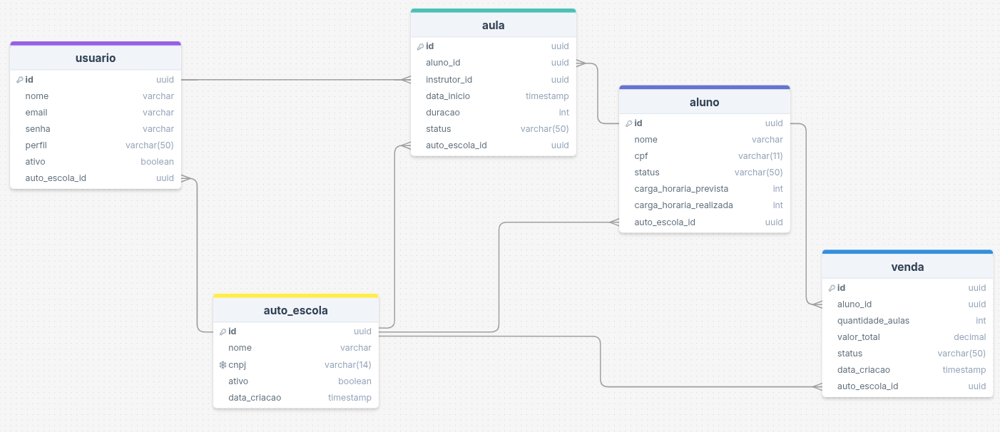

# Controle CFC

> Sistema de gestão para CFCs e autoescolas, focado em organização e simplicidade no dia a dia.

**Controle total do seu CFC**

> Este projeto faz parte do meu portfólio profissional e está sendo desenvolvido seguindo boas práticas de engenharia de software, arquitetura e metodologias ágeis.

---

## Visão Geral

O **Controle CFC** é um sistema **SaaS B2B** voltado para Centros de Formação de Condutores (CFCs) e autoescolas, com foco na gestão de alunos, aulas práticas e vendas de pacotes, seguindo as diretrizes legais e priorizando simplicidade operacional.

---

## Processo de Desenvolvimento

Este projeto está sendo desenvolvido de forma incremental, seguindo práticas inspiradas no **Scrum**, com definição clara de:

- Escopo de MVP
- Histórias de usuário
- Backlog priorizado
- Execução em sprints

### Escopo do MVP

O MVP do Controle CFC foca nos processos essenciais de uma autoescola:

- Cadastro e gestão de autoescolas (multi-tenant)
- Cadastro de usuários (Administrador e Instrutor)
- Cadastro e acompanhamento de alunos
- Venda de pacotes de aulas
- Agendamento e confirmação de aulas práticas
- Controle automático de carga horária e status do aluno

### Documentação
- **Documento de Requisitos (MVP)**  
  [Documento de Requisitos (MVP)](docs/Sistema%20de%20Gerenciamento%20de%20Auto%20Escolas.pdf)

- **Quadro de Backlog (Trello)**  
  [Link do Trello](https://trello.com/invite/b/694a7f653e5736fea21635fe/ATTIf7101634f0a0d71fe4f69e3d2405255e901DC4BE/meu-quadro-do-trello)

- **Arquitetura do Sistema**  
  [Arquitetura](docs/arquitetura.md)

- **Modelo de Domínio**  
  [Modelo de Domínio](docs/dominio.md)

### Modelagem de Dados

O banco de dados do sistema foi modelado utilizando PostgreSQL, com foco em um ambiente SaaS multi-tenant.

---

## Tecnologias

### Backend
- Java 17
- Spring Boot
- Spring Data JPA

### Frontend
- Angular

### Infraestrutura
- PostgreSQL
- Docker
- Git e GitHub

---

## Status do Projeto

🟡 Em desenvolvimento  
Fase atual: definição de arquitetura, modelagem de domínio e estrutura base do backend.

---

## Como Executar (em breve)

As instruções para execução local do projeto serão adicionadas conforme a implementação do backend e frontend avançar.

---

## Evoluções Futuras

- Integração com órgãos oficiais
- Relatórios gerenciais
- Gestão financeira avançada
- Escalabilidade com Kubernetes
